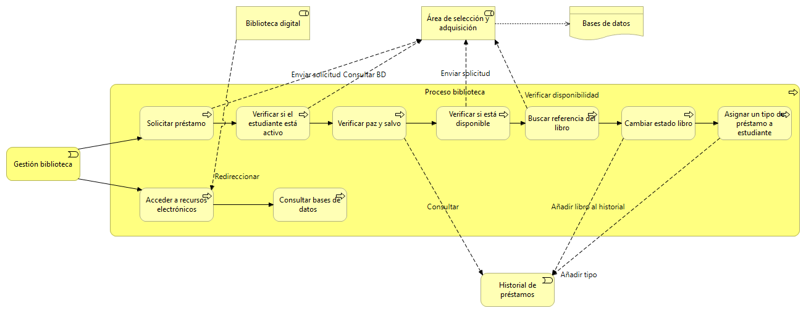
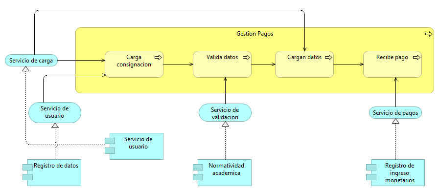
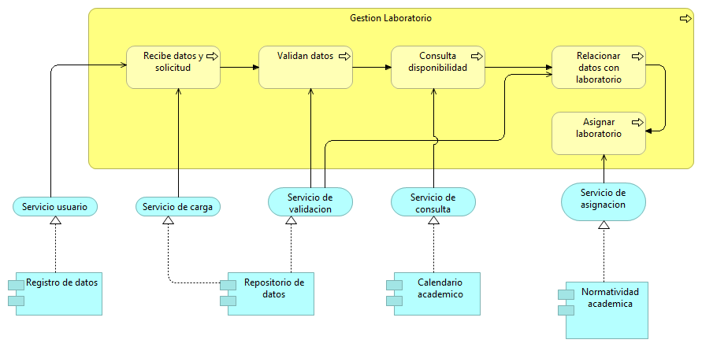
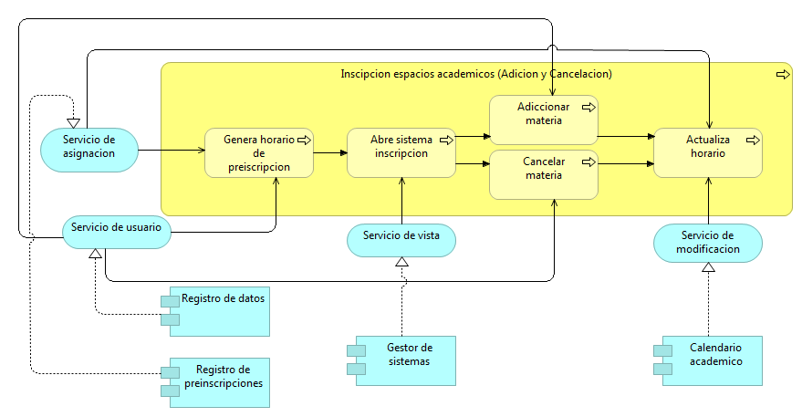

Nosotros consideramos que la arquitectura basada en microservicios aporta una implementación óptima al sistema de Gestión Académica, dado que cada microservicio tendrá una completa autonomía y el sistema posee una cantidad de clientes enorme, la implementación de los microservicios permitirá suplir la demanda y las necesidades de cada cliente que interactúe con él.
Actualmente el sistema de gestión académica está compuesto por varias áreas funcionales las cuales manejan una estructura jerárquica, lo cual no le permite al sistema un adecuado manejo de la información. Aunque dicho manejo no ha generado un problema crítico, la universidad busca impedir futuros inconvenientes en su sistema teniendo en cuenta el avance exponencial de la demanda de estudiantes. Es así como se plantea modificar la arquitectura de dicho sistema con el fin de que éste sea más dinámico y escalable. Teniendo en cuenta estas problemáticas, se requiere una arquitectura que sea escalable, posea funcionalidad modular, los módulos que utilice deben ser independientes y por último, los servicios que ofrece el sistema deben ser manejados de forma independiente; es así como implementar los microservicios es conveniente para una mejor funcionalidad del sistema de gestión académica.

##### Integrantes del grupo
###### Alfonso Rodríguez Brian Giovanny
###### Aponte Barrera Nicolás
###### Blanco Peña Gabriela Fernanda
###### Salgado González Luis Felipe

# Modelo introductorio

# Modelo organizacional 

# Modelo de cooperación

# Modelo Funcional y Procesos Gestión de Notas

## Modelos Funcionales

### Administrativos

### Coordinadores

### Decanatura

### Vicerrectoría

### Docentes
##### 1. Gestión docente

##### 2. Docente

### Oficina de planeación

### Estudiante

## Modelo de procesos

### Proceso Admisiones

### Proceso de asignación de espacios académicos

### Proceso de biblioteca

### Proceso consejería

### Proceso espacios académicos

### Proceso Gestión de documentos

### Proceso gestión laboratorio

### Proceso de inscripción a grado

### Proceso Movilidad Académica

### Proceso de pagos

### Proceso de preinscripción

### Proceso de prueba académica

### Proceso de recibos de pago

### Proceso de registro de notas

### Proceso de reintegro

# Modelo de uso de aplicación

### Admisiones

### Asignación de espacios académicos

### Biblioteca

### Consejerías

### Inscripción a grado

### Movilidad académica

### Preinscripción

### Prueba académica

### Reingreso

### Reporte de notas

### Pagos

### Gestión de documentos

### Gestión de laboratorios

### Inscripción de espacios académicos (Adiciones y cancelaciones)

# Modelo de cooperación de aplicación

# Modelo de Infraestructura de uso

