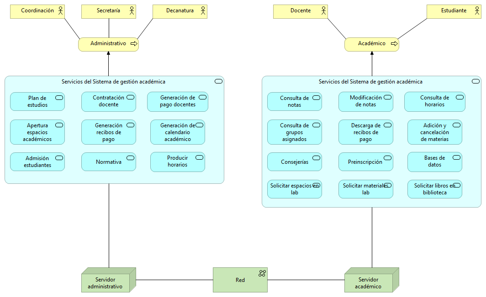
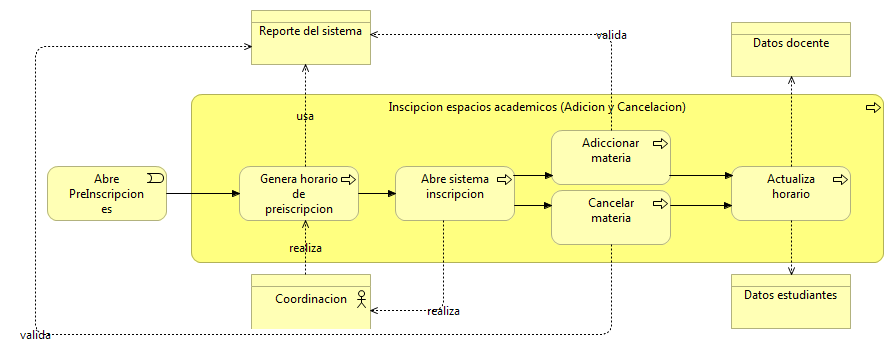
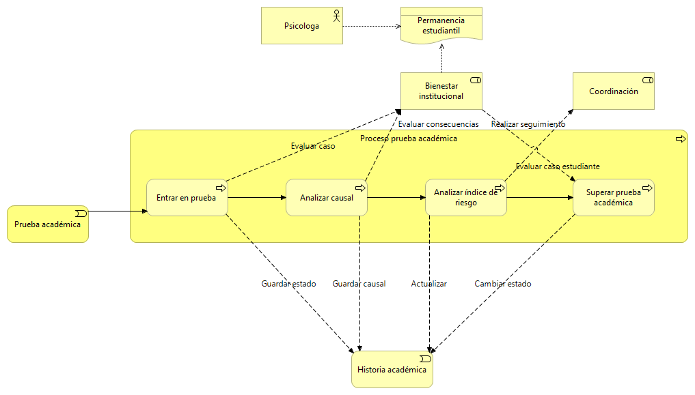
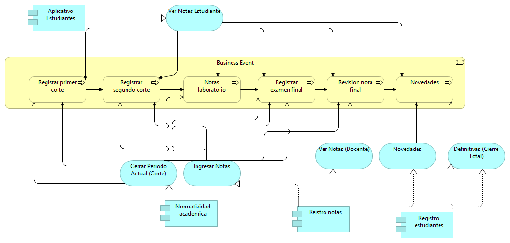

Nosotros consideramos que la arquitectura basada en microservicios aporta una implementación óptima al sistema de Gestión Académica, dado que cada microservicio tendrá una completa autonomía y el sistema posee una cantidad de clientes enorme, la implementación de los microservicios permitirá suplir la demanda y las necesidades de cada cliente que interactúe con él.

##### Integrantes del grupo
###### Alfonso Rodríguez Brian Giovanny
###### Aponte Barrera Nicolás
###### Blanco Peña Gabriela Fernanda
###### Salgado González Luis Felipe

# Modelo introductorio

# Modelo organizacional 

# Modelo de cooperación

# Modelo Funcional y Procesos Gestión de Notas

## Modelos Funcionales

### Administrativos

### Coordinadores

### Decanatura

### Vicerrectoría

### Docentes
##### 1.

##### 2.

### Oficina de planeación

### Estudiante

## Modelo de procesos

### Proceso Admisiones

### Proceso de asignación de espacios académicos

### Proceso de biblioteca

### Proceso consejería

### Proceso espacios académicos

### Proceso Gestión de documentos

### Proceso gestión laboratorio

### Proceso de inscripción a grado

### Proceso Movilidad Académica

### Proceso de pagos

### Proceso de preinscripción

### Proceso de prueba académica

### Proceso de recibos de pago

### Proceso de registro de notas

### Proceso de reintegro

# Modelo de uso de aplicación

### Admisiones

### Asignación de espacios académicos

### Biblioteca

### Consejerías

### Inscripción a grado

### Movilidad académica

### Preinscripción

### Prueba académica

### Reingreso

### Reporte de notas

### Pagos

### Gestión de documentos

### Gestión de laboratorios

### Inscripción de espacios académicos (Adiciones y cancelaciones)

