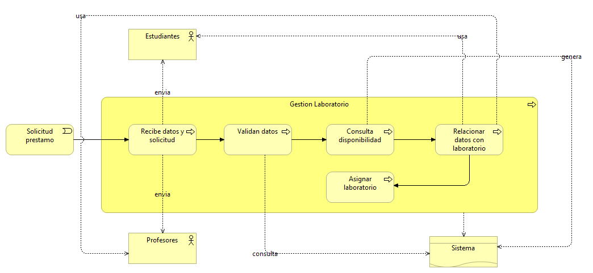
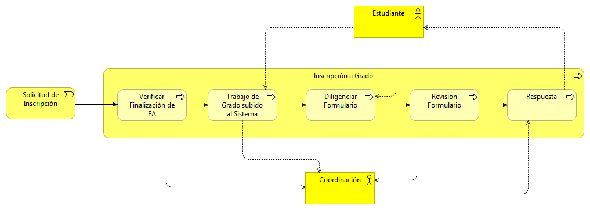

# Modelo Funcional y Procesos Gestión de Notas

## Modelos Funcionales

### Administrativos

### Coordinadores

### Decanatura

### Vicerrectoría

### Docentes
##### 1.

##### 2.

### Oficina de planeación

### Estudiante

## Modelo de procesos

### Proceso Admisiones

### Proceso de asignación de espacios académicos

### Proceso de biblioteca

### Proceso consejería

### Proceso espacios académicos

### Proceso Gestión de docentes

### Proceso gestión laboratorio

### Proceso de inscripción a grado

### Proceso Movilidad Académica

### Proceso de pagos

### Proceso de preinscripción

### Proceso de prueba académica

### Proceso de recibos de pago

### Proceso de registro de notas

### Proceso de reintegro

